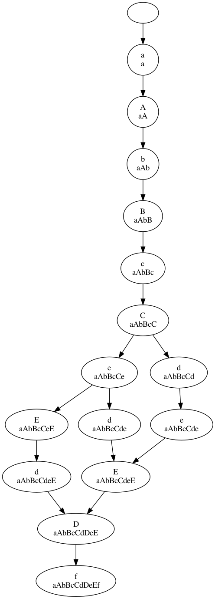

# Day 18

https://adventofcode.com/2019/day/18


## Step 1:
* Generate a DAG representing possible orders
of visiting keys and doors.

    #########
    #b.A.@.a#
    #########

The DAG for this is:

    @->a->A->b

More complex example

    ########################
    #f.D.E.e.C.b.A.@.a.B.c.#
    ######################.#
    #d.....................#
    ########################

I realize that the graph nodes
must include the state:
1. Current position (start, key or door)
2. Current set of keys/doors.

When searching for next place to go,
visit all

It is impossible to go to a location
that is already visited.

## Example:

    #########
    #b.A.@.a#
    #########

First, generate a simple graph with all walls
and tiles.

Condense that graph by doing DFS to find
the closest locations for every location.

```plantuml
graph G1 {
    b 2 A
    A 2 b
    A 2 @
    @ 2 A
    @ 2 a
    a 2 @
}
```

Then use that "distance graph" to find possible
paths for the "state graph".


## Example 2

All roads lead to Rome.

### Gotchas
* Might be more keys than doors

Realization: The goal is to pickup all *keys*.
So the state chart can be simplified.

## Algorithm 1:
* Be at State
* Visit all States reachable from this node
    * Includes traversing map graph with set of keys and start pos
    
### Necessary functions
* FindReachableNodes map keySet pos -> return map[string]int
representing reachable keys and the distance to them. Don't include
  keys that are in keySet, since they are already visited.
  Doors with keys in keyset will be ignored.
  KeySet can probably be a string since the cardinality is so low.

### Necessary datastructures
* `map[State]int`: Minimum distance found from start to some state. 
